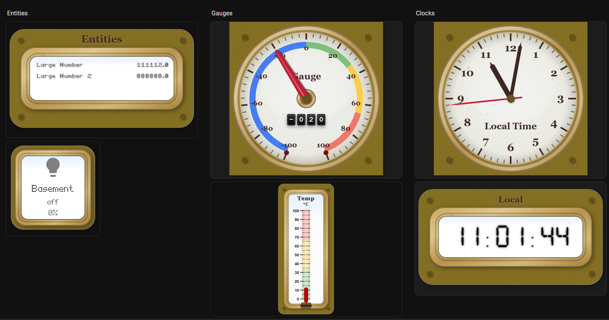
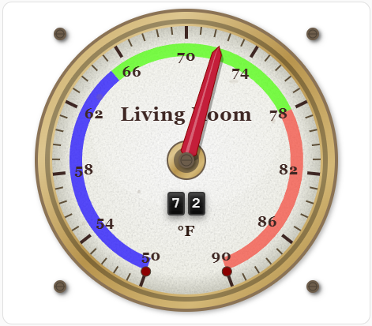
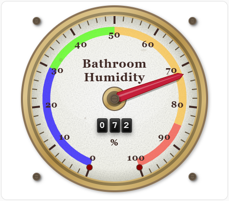
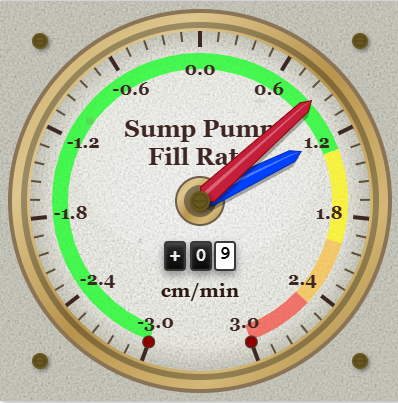
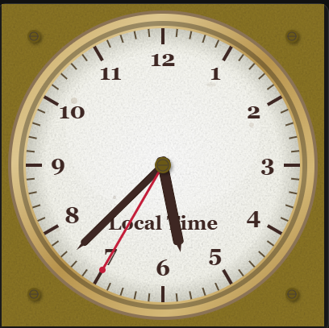
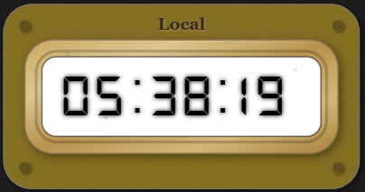
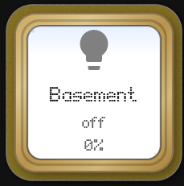
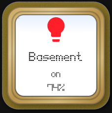
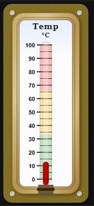
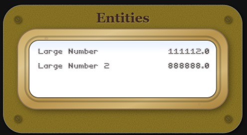

# Foundry Card

[](https://github.com/custom-components/hacs)
[](https://github.com/dprischak/Foundry-Card/releases)
[](LICENSE)

A collection of custom dashboard cards for Home Assistant that are designed with industrial and vintage aesthetics.
<p>

</p>

## Table of Contents
1. [Cards Included](#cards-included)
2. [Installation](#installation)
3. [Usage](#usage)
    - [Foundry Gauge Card](#foundry-gauge-card)
    - [Foundry Analog Clock](#foundry-analog-clock)
    - [Foundry Digital Clock](#foundry-digital-clock)
    - [Foundry Button Card](#foundry-button-card)
    - [Foundry Thermostat](#foundry-thermostat)
    - [Foundry Entities Card](#foundry-entities-card)
4. [Development](#development)
5. [Roadmap](#roadmap)
6. [Support](#support)
7. [License](#license)
8. [Credits](#credits)

<a name="cards-included"></a>
## Cards Included

<a name="foundry-gauge-card"></a>
### ⏱️ Foundry Gauge Card
Display your sensor data with a beautiful foundry gauge visualization featuring:
- Customizable min/max values
- Smooth needle animation
- Theme-aware colors
- Responsive design

<a name="foundry-analog-clock"></a>
### 🕰️ Foundry Analog Clock
A skeuomorphic analog clock with:
- Realistic hand movements
- Multiple ring styles (Brass, Silver, Copper, etc.)
- Time zone support
- Second hand toggling

<a name="foundry-digital-clock"></a>
### 📟 Foundry Digital Clock
A vintage industrial digital display featuring:
- Retro LCD/LED aesthetics
- 12h/24h formats
- Custom backlight and digit colors
- Wear and age effects

<a name="foundry-button-card"></a>
### 🔘 Foundry Button Card
A tactile industrial push-button:
- Realistic press animation
- Configurable indicator light
- Everything Customizable 
- Jinja2 templating support

<a name="foundry-thermostat"></a>
### 🌡️ Foundry Thermostat
An industrial liquid thermometer card:
- Realistic liquid column animation
- Color-coded temperature segments
- Vintage glass tube effects
- Customizable range and units

<a name="foundry-entities-card"></a>
### 📋 Foundry Entities Card
A digital list display for multiple entities:
- Supports secondary info (last-updated, last-changed, etc.)
- Vintage digital VFD/LCD aesthetic
- Customizable fonts and colors
- Same industrial casing options

<a name="installation"></a>
## Installation 

### HACS (Recommended)

1. Open HACS in your Home Assistant instance
2. Click on "Frontend"
3. Click the three dots in the top right corner
4. Select "Custom repositories"
5. Add `https://github.com/dprischak/Foundry-Card` as the repository
6. Select "Lovelace" as the category
7. Click "Add"
8. Find "Foundry Card" in the list and click "Install"
9. Restart Home Assistant

### Manual Installation

1. Download `foundry-card.js` from the [latest release](https://github.com/dprischak/Foundry-Card/releases)
2. Copy it to `<config>/www/` directory (create the `www` folder if it doesn't exist)
3. Add the resource to your Lovelace dashboard:
   - Go to Settings → Dashboards → Resources
   - Click "Add Resource"
   - URL: `/local/foundry-card.js`
   - Resource type: JavaScript Module
4. Refresh your browser

<a name="usage"></a>
## Usage

### Foundry Gauge Card

Add the card to your dashboard:

```yaml
type: custom:foundry-gauge-card
entity: sensor.temperature
name: "Temperature"
min: 0
max: 100
unit: "°C"
```

### Design Features

- **Vintage Aesthetic**: Aged beige/cream background with subtle texture
- **Aged Texture System**: Procedural noise-based texture that can be applied to gauge face only or everywhere
  - Three modes: none, glass_only (default), or everywhere
  - Adjustable intensity (0-100) for fine control over the vintage appearance
  - High-quality filtering prevents washed-out colors
- **Brass Rim**: Gradient brass border with realistic metallic sheen
- **Rivets**: Decorative corner rivets for industrial look
- **Wear Marks**: Configurable age spots and wear marks (0-100 wear level) for authenticity
- **Glass Effect**: Optional subtle highlight overlay simulating glass cover
- **Transparent Plate Option**: Can make the background transparent to show dashboard background
- **Red Needle**: Bold red needle with shadow and highlight
- **Flip Display**: Digital odometer-style display with smooth rolling animation
- **Configurable Odometer**: Adjustable size (25-200) and vertical position (50-150px)
- **Smooth Animation**: Configurable animation duration (default 1.2s) with ease-out transition
- **High Needle Tracking**: Optional high value needle that tracks peak values for a configurable duration
- **Multi-line Titles**: Support for up to 3 lines of text in title using `\n`
- **Decorative Rings**: Choice of brass (default), silver, or no ring styles
- **Customizable Plate**: Adjustable plate color for the gauge face

#### Configuration Options

| Option | Type | Required | Default | Description |
|--------|------|----------|---------|-------------|
| `entity` | string | **Yes** | - | Entity ID to display |
| `title` | string | No | - | Card title (supports multi-line with `\n`) |
| `min` | number | No | 0 | Minimum gauge value |
| `max` | number | No | 100 | Maximum gauge value |
| `unit` | string | No | '' | Unit of measurement |
| `decimals` | number | No | 0 | Number of decimal places to display |
| `segments` | array | No | See below | Color segments configuration |
| `start_angle` | number | No | 200 | Start angle of gauge arc (0 = top, clockwise) |
| `end_angle` | number | No | 160 | End angle of gauge arc (0 = top, clockwise) |
| `animation_duration` | number | No | 1.2 | Animation duration in seconds |
| `title_font_size` | number | No | 12 | Font size for the title text |
| `odometer_font_size` | number | No | 60 | Size of the odometer display (25-200) |
| `odometer_vertical_position` | number | No | 120 | Vertical position of odometer in pixels (50-150) |
| `ring_style` | string | No | 'brass' | Decorative ring style: 'none', 'brass', or 'silver' |
| `rivet_color` | string | No | '#6a5816' | Color of the decorative rivets (hex color code) |
| `plate_color` | string | No | '#8c7626' | Color of the gauge face plate (hex color code) |
| `high_needle_enabled` | boolean | No | false | Enable the high value tracking needle |
| `high_needle_color` | string | No | '#FF9800' | Color of the high needle (hex color code) |
| `high_needle_duration` | number | No | 60 | Duration in seconds to track the high value |
| `high_needle_length` | number | No | 75 | Length of the high needle as percentage (25-150) |
| `plate_transparent` | boolean | No | false | Make the plate transparent (shows background) |
| `wear_level` | number | No | 50 | Amount of wear marks and age spots (0-100) |
| `glass_effect_enabled` | boolean | No | true | Enable glass effect overlay |
| `aged_texture` | string | No | 'everywhere' | Aged texture mode: 'none', 'glass_only', or 'everywhere' |
| `aged_texture_intensity` | number | No | 50 | Intensity of aged texture effect (0-100, higher = more visible) |
| `tap_action` | object | No | `{action: 'more-info'}` | Action to perform on tap (see Actions below) |
| `hold_action` | object | No | `{action: 'more-info'}` | Action to perform on hold (see Actions below) |
| `double_tap_action` | object | No | `{action: 'more-info'}` | Action to perform on double tap (see Actions below) |

#### Example Configurations
<details>
  <summary>Click to see examples</summary>

**Temperature Sensor:**

Using the gauge as a temperature sensor

```yaml
type: custom:foundry-gauge-card
entity: sensor.living_room_temperature
title: Living Room
min: 50
max: 90
unit: °F
segments:
  - from: 50
    to: 68
    color: "#1100ff"
  - from: 68
    to: 78
    color: "#44ff00"
  - from: 78
    to: 90
    color: "#F44336"
```


**Humidity Sensor:**
```yaml
type: custom:foundry-gauge-card
entity: sensor.bathroom_humidity
title: Bathroom\nHumidity
min: 0
max: 100
unit: "%"
segments:
  - from: 0
    to: 30
    color: "#1100ff"
  - from: 30
    to: 50
    color: "#44ff00"
  - from: 50
    to: 85
    color: "#f9bc39"
  - from: 85
    to: 100
    color: "#F44336"
```



**Heavily weathered industrial gauge**
```yaml
type: custom:Foundry-Card
entity: sensor.sumppump_fill_rate
title: Sump Pump\nFill Rate
aged_texture: everywhere
aged_texture_intensity: 80
plate_transparent: false
plate_color: "#d4d4c8"
unit: cm/min
decimals: 1
min: -3
max: 3
rivet_color: "#6a5816"
high_needle_color: "#0040ff"
high_needle_enabled: true
high_needle_length: 75
high_needle_duration: 720
segments:
  - from: -3
    to: 1.3
    color: "#00ff11"
  - from: 1.3
    to: 2
    color: "#fff700"
  - from: 2
    to: 2.5
    color: "#f9bc39"
  - from: 2.5
    to: 3
    color: "#F44336"
```


</details>

### Segment Options

Each segment in the `segments` array can have:

| Option | Type | Required | Description |
|--------|------|----------|-------------|
| `from` | number | **Yes** | Start value of the segment |
| `to` | number | **Yes** | End value of the segment |
| `color` | string | **Yes** | Hex color code for the segment |

### Angle Configuration

The gauge arc can be customized using `start_angle` and `end_angle`:

- **Angle System**: 0° = top of gauge, angles increase clockwise
- **start_angle**: Where the gauge arc begins (default: 200°)
- **end_angle**: Where the gauge arc ends (default: 160°)
- The gauge automatically handles wrapping around 360°
- The needle will always travel along the shortest arc and never cross the "dead zone"

**Common angle configurations:**
- Default (200° to 160°): Classic lower 3/4 arc
- Full semicircle (270° to 90°): Bottom half
- Upper arc (180° to 0°): Top half
- Custom ranges for specific aesthetic needs

### Actions

The card supports tap, hold, and double-tap actions like standard Home Assistant cards. Actions can be configured using `tap_action`, `hold_action`, and `double_tap_action`.

**Available action types:**
- `more-info`: Show entity more-info dialog (default)
- `navigate`: Navigate to a different view
- `call-service`: Call a Home Assistant service
- `toggle`: Toggle the entity
- `shake`: Custom shake animation (needle moves away and returns)
- `none`: No action

**Shake Action Example:**
<details>
  <summary>Click to see examples</summary>


```yaml
type: custom:steam-gauge-card
entity: sensor.temperature
title: Temperature
tap_action:
  action: shake  # Tap to shake the gauge
```

The shake action creates a fun visual effect where the needle moves 10-50% away from the current value and then smoothly returns to the actual value over 3 seconds.
</details>


**Standard Action Examples:**
<details>
  <summary>Click to see examples</summary>


```yaml
# Navigate to another view
tap_action:
  action: navigate
  navigation_path: /lovelace/energy

# Call a service
tap_action:
  action: call-service
  service: light.turn_on
  service_data:
    entity_id: light.living_room

# Toggle an entity
tap_action:
  action: toggle

# No action on tap
tap_action:
  action: none
```
</details>

### High Needle Tracking

The high needle feature tracks the highest (peak) value reached over a configurable time period. This is useful for monitoring maximum temperatures, peak power usage, or any metric where you want to see how high the value has climbed.

**Features:**
- High value tracking needle (customizable color) that marks the highest value
- Automatically resets after the configured duration (default 60 seconds)
- Adjustable needle length (25-150% of standard needle)
- Smooth animations synchronized with main needle

### Aged Texture Effects

The gauge features a realistic aged texture system that adds vintage character to the display. The texture uses procedural noise to simulate the appearance of aged, weathered gauges from the steam era.

**Configuration Options:**
- **`aged_texture`**: Controls where the texture is applied
  - `'none'`: No aged texture effect
  - `'glass_only'`: Applies texture only to the gauge face (default) - creates a subtle aged glass appearance
  - `'everywhere'`: Applies texture to both the background plate and gauge face - creates a fully weathered vintage look
  
- **`aged_texture_intensity`**: Controls the strength of the texture effect (0-100)
  - `0`: No visible texture (clean, modern look)
  - `50`: Moderate texture (default) - balanced vintage appearance
  - `100`: Maximum texture - heavily aged, weathered appearance
  - Higher values make the texture more prominent and visible

### Foundry Analog Clock

Add a vintage analog clock to your dashboard:

#### Configuration Options

| Option | Type | Required | Default | Description |
|--------|------|----------|---------|-------------|
| `entity` | string | No | - | Entity ID (optional, for tap action context) |
| `title` | string | No | "Local Time" | Card title (supports multi-line with `\n`) |
| `title_font_size` | number | No | 12 | Font size for the title text |
| `time_zone` | string | No | Local | Time zone (e.g., "America/New_York") |
| `ring_style` | string | No | 'brass' | Ring style: 'brass', 'silver', 'chrome', 'copper', 'black', 'white', 'blue', 'green', 'red', 'none' |
| `rivet_color` | string | No | '#6d5d4b' | Color of rivets |
| `plate_color` | string | No | '#f5f5f5' | Background plate color |
| `plate_transparent` | boolean | No | false | Make the plate transparent |
| `wear_level` | number | No | 50 | Intensity of wear marks (0-100) |
| `glass_effect_enabled` | boolean | No | true | Enable glass effect overlay |
| `aged_texture` | string | No | 'everywhere' | Aged texture mode: 'none', 'glass_only', 'everywhere' |
| `aged_texture_intensity` | number | No | 50 | Intensity of aged texture effect (0-100) |
| `second_hand_enabled` | boolean | No | true | Show/hide the second hand |
| `tap_action` | object | No | `{action: 'more-info'}` | Action to perform on tap |
| `hold_action` | object | No | `{action: 'more-info'}` | Action to perform on hold |
| `double_tap_action` | object | No | `{action: 'more-info'}` | Action to perform on double tap |


<details>
  <summary>Click to see examples</summary>

```yaml
type: custom:foundry-analog-clock-card
entity: sun.sun
title: Local Time
title_font_size: 12
ring_style: brass
rivet_color: "#6a5816"
plate_color: "#8c7626"
plate_transparent: false
wear_level: 50
glass_effect_enabled: true
aged_texture: everywhere
aged_texture_intensity: 50
second_hand_enabled: true
tap_action:
  action: more-info
hold_action:
  action: more-info
double_tap_action:
  action: more-info
time_zone: America/New_York

```


</details>

### Foundry Digital Clock

A retro digital timepiece:


#### Configuration Options

| Option | Type | Required | Default | Description |
|--------|------|----------|---------|-------------|
| `entity` | string | No | - | Entity ID (optional, for tap action context) |
| `title` | string | No | "Local Time" | Card title |
| `title_font_size` | number | No | 14 | Font size for the title text |
| `use_24h_format` | boolean | No | true | Use 24-hour format (false for 12h) |
| `show_seconds` | boolean | No | true | Show seconds display |
| `time_zone` | string | No | Local | Time zone (e.g., "America/New_York") |
| `ring_style` | string | No | 'brass' | Ring style: 'brass', 'silver', 'chrome', 'copper', 'black', 'white', 'blue', 'green', 'red' |
| `rivet_color` | string | No | '#6d5d4b' | Color of rivets |
| `plate_color` | string | No | '#f5f5f5' | Background plate color |
| `plate_transparent` | boolean | No | false | Make the plate transparent |
| `font_color` | string | No | '#000000' | Color of the digital digits |
| `font_bg_color` | string | No | '#ffffff' | Background color of the display area |
| `wear_level` | number | No | 50 | Intensity of wear marks (0-100) |
| `glass_effect_enabled` | boolean | No | true | Enable glass effect overlay |
| `aged_texture` | string | No | 'everywhere' | Aged texture mode: 'none', 'glass_only', 'everywhere' |
| `aged_texture_intensity` | number | No | 50 | Intensity of aged texture effect (0-100) |
| `tap_action` | object | No | `{action: 'more-info'}` | Action to perform on tap |
| `hold_action` | object | No | `{action: 'more-info'}` | Action to perform on hold |
| `double_tap_action` | object | No | `{action: 'more-info'}` | Action to perform on double tap |

<details>
  <summary>Click to see examples</summary>

```yaml
type: custom:foundry-digital-clock-card
entity: sun.sun
title: Local
title_font_size: 12
ring_style: brass
rivet_color: "#6a5816"
plate_color: "#8c7626"
plate_transparent: false
font_bg_color: "#ffffff"
font_color: "#000000"
show_seconds: true
wear_level: 50
glass_effect_enabled: true
aged_texture: everywhere
aged_texture_intensity: 50
use_24h_format: false
time_zone: America/New_York
```


</details>

</details>

### Foundry Button Card

A robust industrial push-button with integrated status text and icon.

#### Configuration Options

| Option | Type | Required | Default | Description |
|--------|------|----------|---------|-------------|
| `entity` | string | No | - | Entity to control/monitor |
| `icon` | string | No | - | Icon to display |
| `primary_info` | string | No | - | Primary text (top line) |
| `secondary_info` | string | No | - | Secondary text (middle line) |
| `secondary_info_2` | string | No | - | Extra info text (bottom line) |
| `card_width` | number | No | 240 | Maximum width of the card in pixels |
| `ring_style` | string | No | 'brass' | Ring style: 'brass', 'silver', 'chrome', etc. |
| `plate_color` | string | No | '#f5f5f5' | Button face color |
| `font_color` | string | No | '#000000' | Text color |
| `font_bg_color` | string | No | '#ffffff' | Text background inset color |
| `icon_color` | string | No | - | Color of the icon |
| `wear_level` | number | No | 50 | Wear intensity (0-100) |
| `aged_texture` | string | No | 'everywhere' | Texture mode |
| `aged_texture_intensity` | number | No | 50 | Texture intensity |
| `tap_action` | object | No | - | Action on tap |

<details>
  <summary>Click to see examples</summary>

```yaml
type: custom:foundry-button-card
entity: light.basement_cans_group
icon: mdi:lightbulb
primary_info: Basement
secondary_info: "{{states('light.basement_cans_group')}}"
ring_style: brass
plate_color: "#8c7626"
font_bg_color: "#ffffff"
font_color: "#000000"
wear_level: 50
glass_effect_enabled: true
aged_texture: everywhere
aged_texture_intensity: 50
plate_transparent: false
secondary_info_2: >-
  {{ (state_attr('light.basement_cans_group', 'brightness') | int(0) / 2.55) |
  round(0) | int }}%
icon_color: |-
  
  
    #{{ '%02x%02x%02x' | format(rgb[0], rgb[1], rgb[2]) }}
  
    grey
  
card_width: 240
tap_action:
  action: more-info
```

 

</details>


### Foundry Thermostat

An industrial liquid-in-glass thermometer:

#### Configuration Options

| Option | Type | Required | Default | Description |
|--------|------|----------|---------|-------------|
| `entity` | string | **Yes** | - | Temperature entity to monitor |
| `title` | string | No | "Temperature" | Card title |
| `title_font_color` | string | No | "#3e2723" | Color of the title text |
| `unit` | string | No | - | Unit of measurement string to display |
| `min` | number | No | -40 | Minimum temperature value |
| `max` | number | No | 120 | Maximum temperature value |
| `ring_style` | string | No | 'brass' | Casing style: 'brass', 'silver', 'copper', 'black', 'white', 'blue', 'green', 'red', 'none' |
| `liquid_color` | string/array | No | '#cc0000' | Color of the liquid (mercury) |
| `mercury_width` | number | No | 50 | Width of liquid column (percentage of tube) |
| `segments_under_mercury` | boolean | No | true | Render colored segments behind the liquid tube |
| `segments` | array | No | [] | Color zones (from/to/color) |
| `animation_duration` | number | No | 1.5 | Animation speed in seconds |
| `plate_color` | string | No | '#8c7626' | Background plate color |
| `plate_transparent` | boolean | No | false | Make the plate transparent |
| `rivet_color` | string | No | '#6a5816' | Color of rivets |
| `font_bg_color` | string | No | '#ffffff' | Background color of the tube scale area |
| `wear_level` | number | No | 50 | Intensity of wear marks (0-100) |
| `glass_effect_enabled` | boolean | No | true | Enable glass effect overlay |
| `aged_texture` | string | No | 'everywhere' | Aged texture mode: 'none', 'glass_only', 'everywhere' |
| `aged_texture_intensity` | number | No | 50 | Intensity of aged texture effect (0-100) |
| `tap_action` | object | No | `{action: 'more-info'}` | Action to perform on tap |


<details>
  <summary>Click to see examples</summary>

```yaml
type: custom:foundry-thermostat-card
entity: sensor.outside_temperature
min: 0
max: 100
ring_style: brass
title: Temp
mercury_width: 50
segments_under_mercury: true
animation_duration: 1.5
plate_color: "#8c7626"
rivet_color: "#ffffff"
font_bg_color: "#fcfcfc"
title_font_color: "#000000"
segments:
  - from: 0
    to: 33
    color: "#4CAF50"
  - from: 33
    to: 66
    color: "#FFC107"
  - from: 66
    to: 100
    color: "#F44336"
liquid_color: "#cc0000"
plate_transparent: false
glass_effect_enabled: true
wear_level: 50
aged_texture: everywhere
aged_texture_intensity: 50
unit: °C

```


</details>


### Foundry Entities Card

A digital display for a list of entities.

#### Configuration Options

| Option | Type | Required | Default | Description |
|--------|------|----------|---------|-------------|
| `entities` | array | **Yes** | - | List of entities to display. Can be strings or objects. |
| `title` | string | No | "Entities" | Card title |
| `title_font_size` | number | No | 14 | Font size for the title text |
| `ring_style` | string | No | 'brass' | Casing style: 'brass', 'silver', 'copper', 'black', 'white', 'blue', 'green', 'red' |
| `plate_color` | string | No | '#f5f5f5' | Background plate color |
| `plate_transparent` | boolean | No | false | Make the plate transparent |
| `rivet_color` | string | No | '#6d5d4b' | Color of rivets |
| `font_bg_color` | string | No | '#ffffff' | Background color of digital display area |
| `font_color` | string | No | '#000000' | Color of the digital text |
| `wear_level` | number | No | 50 | Intensity of wear marks (0-100) |
| `glass_effect_enabled` | boolean | No | true | Enable glass effect overlay |
| `aged_texture` | string | No | 'everywhere' | Aged texture mode: 'none', 'glass_only', 'everywhere' |
| `aged_texture_intensity` | number | No | 50 | Intensity of aged texture effect (0-100) |
| `tap_action` | object | No | `{action: 'more-info'}` | Action to perform on tap |

<details>
  <summary>Click to see examples</summary>

```yaml
type: custom:foundry-entities-card
entities:
  - entity: input_number.testlargenumber1
    name: Large Number
    secondary_info: none
  - entity: input_number.testlargenumber2
    name: Large Number 2
    secondary_info: none
title: Entities
title_font_size: 14
ring_style: brass
rivet_color: "#6a5816"
plate_color: "#8c7626"
plate_transparent: false
font_bg_color: "#ffffff"
font_color: "#0a0000"
wear_level: 50
glass_effect_enabled: true
aged_texture: everywhere
aged_texture_intensity: 50
```


</details>


<a name="development"></a>
## Development

Want to contribute or customize the cards?

### Prerequisites

1. **Install Node.js**
   - Download and install Node.js from [nodejs.org](https://nodejs.org/), which includes `npm`.


### Setting Up Your Development Environment

1. **Clone the Repository**
   ```bash
   git clone https://github.com/dprischak/Foundry-Card.git
   cd Foundry-Card
   ```
   
2. **Install Dependencies**
   ```bash
   npm install
   ```
### Development Workflow

1. **Create a branch and make the changes into that branch**
   ```bash
   git checkout -b feature/your-feature-name
   # or
   git checkout -b fix/your-bug-fix
   ```

2. Make Your Changes:
   - Write clean, readable code
   - Follow the existing code style
   - Add comments for complex logic
   - Update documentation if needed 

3. **Build the Project**
   ```bash
   npm run build
   ```

4. Commit your changes
   ```bash
   git add .
   git commit -m "feat: add new feature" # or "fix: resolve bug"
   ```
   
5. Push and Create a Pull Request:
   ```bash
   git push origin feature/your-feature-name
   ```

Then open a pull request on GitHub with a clear description of your changes.

## Ways to Contribute
- **Report Bugs:** Open an issue with detailed steps to reproduce
- **Suggest Features:** Share your ideas for improvements
- **Fix Issues:** Look for open issues and submit fixes
- **Improve Documentation:** Help make the docs clearer and more comprehensive


<a name="roadmap"></a>
## Roadmap

Future cards planned for the Foundry Card collection:
- Retro Sliders
- Seismic Graph Card
- Industrial Uptime Card
- Industrial Energy Map
- Industrial Climate Card


<a name="support"></a>
## Support

If you encounter any issues or have feature requests:
- [Open an issue](https://github.com/dprischak/Foundry-Card/issues)
- [Start a discussion](https://github.com/dprischak/Foundry-Card/discussions)

<a name="license"></a>
## License

This project is licensed under the MIT License - see the [LICENSE](LICENSE) file for details.

<a name="credits"></a>
## Credits

Created by [dprischak](https://github.com/dprischak) and [KeithSobo](https://github.com/KeithSobo)

If you find this project useful, consider giving it a ⭐ on GitHub!
